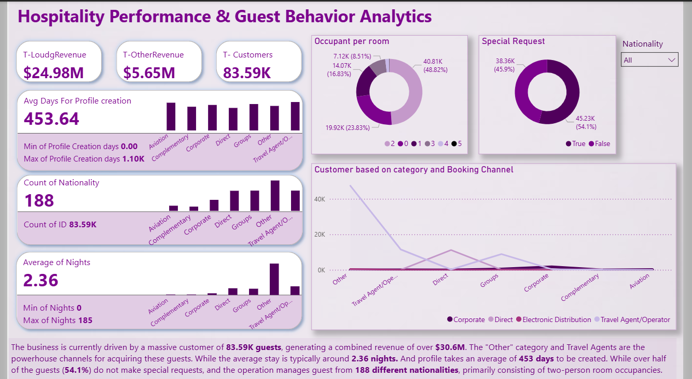

# Hospitality Performance & Guest Behavior Analytics

##  Project Overview
This project features a comprehensive **Power BI** dashboard designed to provide actionable insights for hotel management. By analyzing a massive customer base of **83,590 guests**, this tool tracks revenue performance, booking preferences, and demographic stay patterns to drive business growth.

## Key Business Insights
* **Revenue Generation**: Successfully tracked a total combined revenue of **$30.63M**, segmented into lodging ($24.98M) and secondary revenue streams ($5.65M).
* **Global Reach**: The business manages guests from **188 different nationalities**, showcasing a highly diverse and international market reach.
* **Booking Dynamics**: Identified that the "Other" category and **Travel Agents/Operators** are the powerhouse channels for customer acquisition.
* **Guest Behavior**: Discovered that over half of the guests (**54.1%**) do not make special requests, and the average stay duration is **2.36 nights**.
* **Room Occupancy**: 48.8% of rooms are occupied by two people, providing critical data for room inventory planning.

## Technical Implementation (Power BI)
* **Data Cleansing**: Used **Power Query** to handle complex profile creation timelines (averaging 453 days).
* **Visual Storytelling**: 
    * **Donut Charts**: For room occupancy and special request ratios.
    * **Clustered Bar Charts**: For profile creation and nationality distribution.
    * **Line Charts**: For analyzing booking channel volume.
* **DAX Formulas**: Implemented measures for Average Nights, Total Revenue, and Percentage splits.

## Visuals

